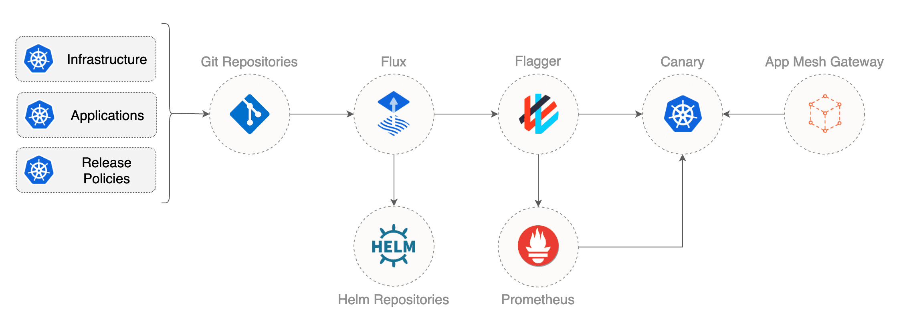
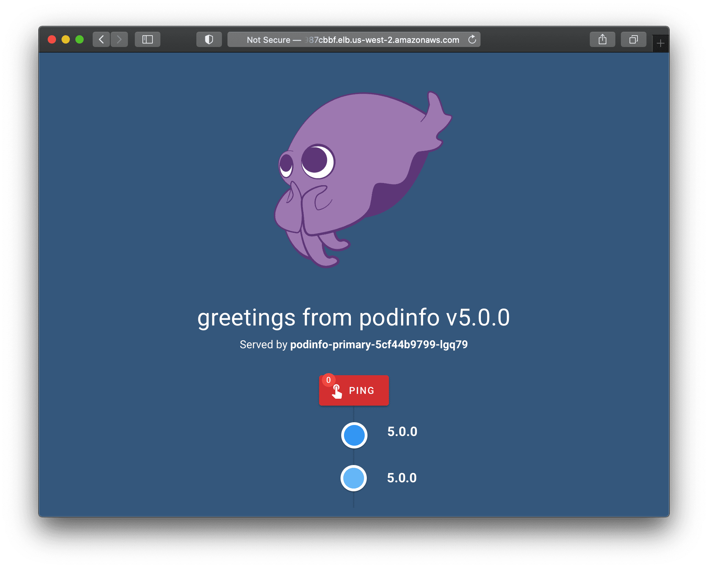

# gitops-appmesh

Welcome to the EKS Progressive Delivery hands-on featuring Flux v2, Flagger and AWS App Mesh.



## Prerequisites

Install [eksctl](https://eksctl.io/), [yq](https://mikefarah.gitbook.io/yq/)
and the [Flux](https://github.com/fluxcd/flux2) CLI:

```sh
brew install eksctl yq fluxcd/tap/flux
```

In order to follow the guide you'll need a GitHub account and a
[personal access token](https://help.github.com/en/github/authenticating-to-github/creating-a-personal-access-token-for-the-command-line)
that can create repositories (check all permissions under `repo`).

Fork this repository on your personal GitHub account and export your access token, username and repo:

```sh
export GITHUB_TOKEN=<your-token>
export GITHUB_USER=<your-username>
export GITHUB_REPO=gitops-appmesh
```

Clone the repository on your local machine:

```sh
git clone https://github.com/${GITHUB_USER}/${GITHUB_REPO}.git
cd ${GITHUB_REPO}
```

## Cluster bootstrap

Create a cluster with eksctl:

```sh
eksctl create cluster -f .eksctl/config.yaml
```

The above command with create a Kubernetes cluster v1.18 with two `m5.large` nodes in the us-west-2 region.

Verify that your EKS cluster satisfies the prerequisites with:

```console
$ flux check --pre
► checking prerequisites
✔ kubectl 1.19.4 >=1.18.0
✔ Kubernetes 1.18.9-eks-d1db3c >=1.16.0
✔ prerequisites checks passed
```

Install Flux on your cluster with:

```sh
flux bootstrap github \
    --owner=${GITHUB_USER} \
    --repository=${GITHUB_REPO} \
    --branch=main \
    --personal \
    --path=clusters/appmesh
```

The bootstrap command commits the manifests for the Flux components in `clusters/appmesh/flux-system` dir
and creates a deploy key with read-only access on GitHub, so it can pull changes inside the cluster.

Wait for the cluster reconciliation to finish:

```console
$ watch flux get kustomizations 
NAME          	REVISION                                     	READY
apps          	main/582872832315ffca8cf24232b0f6bcb942131a1f	True
cluster-addons	main/582872832315ffca8cf24232b0f6bcb942131a1f	True	
flux-system   	main/582872832315ffca8cf24232b0f6bcb942131a1f	True	
mesh          	main/582872832315ffca8cf24232b0f6bcb942131a1f	True	
mesh-addons   	main/582872832315ffca8cf24232b0f6bcb942131a1f	True	
```

Verify that Flagger, Prometheus, AppMesh controller and gateway Helm releases have been installed:

```console
$ flux get helmreleases --all-namespaces 
NAMESPACE      	NAME              	REVISION	READY
appmesh-gateway	appmesh-gateway   	0.1.5   	True
appmesh-system 	appmesh-controller	1.2.0   	True
appmesh-system 	appmesh-prometheus	1.0.0   	True
appmesh-system 	flagger           	1.2.0   	True
kube-system    	metrics-server    	5.0.1   	True
```

## Application bootstrap

To experiment with progressive delivery, you'll be using a small Go application called
[podinfo](https://github.com/stefanprodan/podinfo).
The demo app is exposed outside the cluster with AppMesh Gateway.
The communication between the gateway and podinfo is managed by Flagger and AppMesh.

The application manifests are comprised of a Kubernetes deployment, a horizontal pod autoscaler,
a gateway route (AppMesh custom resource) and release polices (Flagger custom resources).

```
./apps/podinfo/
├── abtest.yaml
├── canary.yaml
├── deployment.yaml
├── gateway-route.yaml
├── hpa.yaml
└── kustomization.yaml
```

Based on the release policy, Flagger configures the mesh and bootstraps the application inside the cluster.

Wait for Flagger to initialize the canary:

```console
$ watch kubectl -n apps get canary
NAME      STATUS      WEIGHT   LASTTRANSITIONTIME
podinfo   Initialized 0        2020-11-14T12:03:39Z
```

Find the AppMesh Gateway public address with:

```sh
export URL="http://$(kubectl -n appmesh-gateway get svc/appmesh-gateway -o jsonpath='{.status.loadBalancer.ingress[0].hostname}')"
echo $URL
```

Wait for the DNS to propagate and  podinfo to become accessible:

```console
$ watch curl -s ${URL}
{
  "hostname": "podinfo-primary-5cf44b9799-lgq79",
  "version": "5.0.0"
}
```

When the URL becomes available, open it in a browser and you'll see the podinfo UI.



## Automated canary promotion

When you deploy a new podinfo version, Flagger gradually shifts traffic to the canary,
and at the same time, measures the requests success rate as well as the average response duration.
Based on an analysis of these App Mesh provided metrics, a canary deployment is either promoted or rolled back.


The canary analysis is defined in [apps/podinfo/canary.yaml](apps/podinfo/canary.yaml):

```yaml
  analysis:
    # max traffic percentage routed to canary
    maxWeight: 50
    # canary increment step
    stepWeight: 5
    # time to wait between traffic increments
    interval: 15s
    # max number of failed metric checks before rollback
    threshold: 5
    # AppMesh Prometheus checks
    metrics:
      - name: request-success-rate
        # minimum req success rate percentage (non 5xx)
        thresholdRange:
          min: 99
        interval: 1m
      - name: request-duration
        # maximum req duration in milliseconds
        thresholdRange:
          max: 500
        interval: 1m
```

Pull the changes from GitHub:

```sh
git pull origin main
```

Bump podinfo version from `5.0.0` to `5.0.1`:

```sh
yq w -i ./apps/kustomization.yaml images[0].newTag 5.0.1
```

Commit and push changes:

```sh
git add -A && \
git commit -m "podinfo 5.0.1" && \
git push origin main
```

Tell Flux to pull the changes or wait one minute for Flux to detect the changes:

```sh
flux reconcile source git flux-system
```

Wait for the cluster reconciliation to finish:

```sh
watch flux get kustomizations
```

When Flagger detects that the deployment revision changed, it will start a new rollout.
You can monitor the traffic shifting with:

```sh
watch kubectl -n apps get canary
```

Watch Flagger logs:

```console
$ kubectl -n appmesh-system logs deployment/flagger -f | jq .msg
New revision detected! Scaling up podinfo.apps
Starting canary analysis for podinfo.apps
Pre-rollout check acceptance-test passed
Advance podinfo.apps canary weight 5
Advance podinfo.apps canary weight 10
Advance podinfo.apps canary weight 15
Advance podinfo.apps canary weight 20
Advance podinfo.apps canary weight 25
Advance podinfo.apps canary weight 30
Advance podinfo.apps canary weight 35
Advance podinfo.apps canary weight 40
Advance podinfo.apps canary weight 45
Advance podinfo.apps canary weight 50
Copying podinfo.apps template spec to podinfo-primary.apps
Routing all traffic to primary
Promotion completed! Scaling down podinfo.apps
```

Lastly, open up podinfo in the browser. You'll see that as Flagger shifts more traffic
to the canary according to the policy in the Canary object,
we see requests going to our new version of the app.

## A/B testing

Besides weighted routing, Flagger can be configured to route traffic to the canary based on HTTP match conditions.
In an A/B testing scenario, you'll be using HTTP headers or cookies to target a certain segment of your users.
This is particularly useful for frontend applications that require session affinity.

Enable A/B testing:

```sh
yq w -i ./apps/podinfo/kustomization.yaml resources[0] abtest.yaml
```

The above configuration will run a canary analysis targeting users based on their browser user-agent.

The A/B test routing is defined in [apps/podinfo/abtest.yaml](apps/podinfo/abtest.yaml):

```yaml
  analysis:
    # number of iterations
    iterations: 10
    # time to wait between iterations
    interval: 15s
    # max number of failed metric checks before rollback
    threshold: 5
    # user segmentation
    match:
      - headers:
          user-agent:
            regex: ".*(Firefox|curl).*"
```

Bump podinfo version to `5.0.2`:

```sh
yq w -i ./apps/kustomization.yaml images[0].newTag 5.0.2
```

Commit and push changes:

```sh
git add -A && \
git commit -m "podinfo 5.0.2" && \
git push origin main
```

Tell Flux to pull changes:

```sh
flux reconcile source git flux-system
```

Wait for Flagger to start the A/B test:

```console
$ kubectl -n appmesh-system logs deploy/flagger -f | jq .msg
New revision detected! Scaling up podinfo.apps
Starting canary analysis for podinfo.apps
Pre-rollout check acceptance-test passed
Advance podinfo.apps canary iteration 1/10
```

Open the podinfo URL in Firefox and you will be routed to version `5.0.2` or use curl:

```console
$ curl ${URL}
{
  "hostname": "podinfo-6cf9c5fd49-9fzbt",
  "version": "5.0.2"
}
```

## Automated rollback

During the canary analysis you can generate HTTP 500 errors and high latency
to test if Flagger pauses and rolls back the faulted version.

Generate HTTP 500 errors every 30s with curl:

```sh
watch -n 0.5 curl ${URL}/status/500
```

When the number of failed checks reaches the canary analysis threshold,
the traffic is routed back to the primary and the canary is scaled to zero.

```console
$ kubectl -n appmesh-system logs deploy/flagger -f | jq .msg
Advance podinfo.apps canary iteration 2/10
Halt podinfo.apps advancement success rate 98.82% < 99%
Halt podinfo.apps advancement success rate 97.93% < 99%
Halt podinfo.apps advancement success rate 97.51% < 99%
Halt podinfo.apps advancement success rate 98.08% < 99%
Halt podinfo.apps advancement success rate 96.88% < 99%
Rolling back podinfo.apps failed checks threshold reached 5
Canary failed! Scaling down podinfo.apps
```

If you go back to Firefox, you'll see that the podinfo version has been rollback to `5.0.1`.
Note that on Chrome or Safari, users haven't been affected by the faulty version,
as they were not routed to `5.0.2` during the analysis.

## Cleanup

Suspend the cluster reconciliation:

```sh
flux suspend kustomization cluster-addons
```

Delete the AppMesh objects:

```sh
kubectl delete mesh --all
```

Delete the EKS cluster:

```sh
eksctl delete cluster -f .eksctl/config.yaml
```
